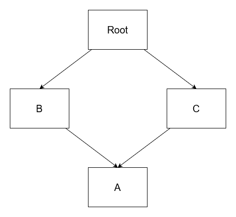

# The Chalupa Cookbook

  

> Note: We aimed to keep the code snippets in this handbook short and slim. Therefore, they may not contain every detail needed to be compiled and run. Nevertheless, we believe that they are easier to read and comprehend this way.

  * [What is Chalupa?](#what-is-Chalupa)
  * [My First Service](#my-first-service)
  * [Chalupa Packages](#chalupa-packages)
  * [Configuration](#configuration)
    * [Environment Variable Prefix](#environment-variable-prefix)
    * [Loading Configuration Files](#loading-configuration-files)
  * [Logging](#logging)
    * [Switching the Provider](#switching-the-provider)
    * [Configuring Logging](#configuring-logging)
  * [Plugins](#plugins)
    * [Global Use](#global-use)
  * [Dependency Injection](#dependency-injection)
    * [Class Binding](#class-binding)
    * [Interface Binding](#interface-binding)
    * [Constant Binding](#constant-binding)
    * [Configuration-dependent Binding](#configuration-dependent-binding)
    * [Injecting Multiple Values of the Same Type](#injecting-multiple-values-of-the-same-type)
    * [Rebinding](#rebinding)
    * [Unbinding](#unbinding)
    * [Wiring Things Up](#wiring-things-up)
    * [Shorthand Notations](#shorthand-notations)
  * [Modules](#modules)
    * [Module Graph](#module-graph)
    * [Dynamic Modules](#dynamic-modules)
    * [Altering Module Bindings](#altering-module-bindings)
  * [Service Communication](#service-communication)
    * [Inbound Communication](#inbound-communication)
    * [Outbound Communication](#outbound-communication)
    * [Appeared and Disappeared Events](#appeared-and-disappeared-events)
  * [Communication Strategies](#communication-strategies)
    * [In-Memory](#in-memory)
    * [Darcon](#darcon)
    * [Inter-process Communication](#inter-process-communication)
  * [Service Lifecycle](#service-lifecycle)
    * [Timing and Order](#timing-and-order)
  * [Error Handling](#error-handling)
  * [Testing](#testing)
    * [Invoking Appeared Events](#invoking-appeared-events)
    * [Accessing the Context](#accessing-the-context)
    * [Overriding Configurations](#overriding-configurations)
    * [Testing Modules](#testing-modules)
  * [Extending Chalupa](#extending-chalupa)

## What is Chalupa?

Chalupa was written to help developers write better software faster.

> Like the idea of "better software faster"?  Check out Dave Farley's (the co-author of the classic Continuous Delivery book) YouTube channel where he talks about various software engineering topics: [Continuous Delivery on YouTube](https://www.youtube.com/c/ContinuousDelivery/featured).

Concretely, Chalupa is a thin layer of abstraction over a communication machinery with dependency injection, configuration handling and external service management baked in. There is more to this than meets the eye, however, since the greatest benefit of even such a thin layer is a clear guidance regarding the organization of services, enabling:

  * the separation of concerns,
  * modularity and reusability,
  * test-first design.

Thus, how your services work stays the same, but the way you write them is going to be much more fun.

## My First Service

> Here we only show a barebones service for the sake of introduction. If you want to generate a service repository with all the bells and whistles, then use `npm init @chalupajs/service` or `npx @chalupajs/create-service`.

Without further ado, let's jump straight into some code, shall we?

~~~~TypeScript
import { Chalupa, InMemoryStrategy } from '@chalupajs/service'
import { Service, ServiceMethod } from '@chalupajs/interface'

/* 1. */
@Service()
class PizzaService {
  /* 2. */
  @ServiceMethod()
  async hello(): string {
    return 'Hello, world!'
  }
}

async function start() {
  /* 3. */
  const service = await Chalupa
    .builder()
    .createServiceWithStrategy(PizzaService, InMemoryStrategy)

  /* 4. */
  await service.start()
}

start().catch(console.error)
~~~~

Above, we have a fully functional Chalupa service, which, while doing nothing useful, when started, will publish itself to an in-memory event bus.

  1. The entrypoint of the service is the `PizzaService` class, decorated with the `@Service` decorator.
  1. Services can expose methods to other services using the `ServiceMethod` decorator. In our case, other services can call the `hello` method on `PizzaService`.
  1. In the `start` function, we create a new Chalupa builder using the `Chalupa.builder()` call. Then, we pass our service class to the `createServiceWithStrategy` function, along with the `InMemoryStrategy`. These two then produce an executable service from our class, that is able to publish itself to the in-memory event buss.
  1. Finally, calling `start` on the produced service actually fires up event handling.

> Chalupa makes heavy use of TypeScript decorators. You can use these resources to learn more about them:
>
>   * [A Practical Guide to TypeScript Decorators](https://blog.logrocket.com/a-practical-guide-to-typescript-decorators/),
>   * [TypeScript Documentation - Decorators](https://www.typescriptlang.org/docs/handbook/decorators.html).

So, now we know how to create a service, but what is a service exactly? It is an independent component, communicating with other services via a selected [communication strategy](#communication-strategies), in the above case, the built-in [In-Memory Strategy](#in-memory-strategy). The interface of a service (that is made available to other services) is then comprised by its `ServiceMethods` and `ServiceEvents` (see [Service Communication](#service-communication)).

In our current case, the name of the published service is going to be the name of the class, `PizzaService`. This can be overridden by setting the `name` option of the `@Service` decorator, as follows.

~~~~TypeScript
@Service({
  name: 'Pizza'
})
class PizzaService {}
~~~~

## Chalupa Packages

Chalupa is developed in a monorepo (https://github.com/chalupajs/chalupa) and consists of several smaller packages. What are these and when should you use them?

  * `@chalupajs/interface`
    * The core decorators and types used by Chalupa. Writing a module, a plugin or something along those lines? This package is a must then for you.
  * `@chalupajs/service`
    * As its name suggests, `interface` is mostly the public interface of Chalupa. The actual implementation, the classes that make ue of the decorators and such reside in the `service` module. Thus, if you want to create an executable service, then use this package.
  * `@chalupajs/test-framework`
    * Integration test support for Chalupa (see [Testing](#testing)). If you want to test your modules or services, then this is your package.
  * `@chalupajs/logger-pino`
    * [pino](https://github.com/pinojs/pino) logging backend. See [Switching the Provider](#switching-the-provider) on how to make use of the non-default logging backend.
  * `@chalupajs/logger-tslog`
    * [tslog](https://github.com/fullstack-build/tslog) logging backend. See [Switching the Provider](#switching-the-provider) on how to make use of the non-default logging backend.
  * `@chalupajs/communication-darcon`
    * [Darcon](https://github.com/imrefazekas/darcon)-based communication layer. Use this package if you want your services to talk to each other via Darcon.
  * `@chalupajs/db-mongo`
    * Module for connecting to [MongoDB](https://www.mongodb.com/) via [node-mongodb-native](https://github.com/mongodb/node-mongodb-native).

## Configuration

In most cases, our service has some configurable knobs and toggles to alter its behavior. The widely adopted solution to configure these properties is to load their values from environment variables or configuration files. Chalupa supports this by using [konvenient](https://github.com/dwmt/konvenient) as its configuration solution. However, you don't have to install and import konvenient directly, as Chalupa re-exports the declarations of konvenient for your convenience (haha, got 'em!).

> In what follows, we will only scratch the surface of konvenient's capabilities, hence, make sure to check out [its documentation](https://github.com/dwmt/konvenient#--konvenient) for more involved examples and recipes.

Now, let us assume, that we want to save some files into a configurable directory. We can expose this setting via a configuration class as follows.

~~~~TypeScript
import { Configuration, Configurable } from '@chalupajs/interface'

@Configuration()
class PizzaConfig {
  @Configurable({
    doc: 'The data directory to save files into.',
    format: String,
  })
  dataDirectory = '/data/pizza'
}
~~~~

As you can see, this is also done via decorators, in this case, `@Configuration`, which is used to mark a class a configuration class, and `@Configurable` which marks configurable properties.

The `dataDirectory` property has a short documentation string, a format (set to `string`) which is used for validation and a default value if nothing is provided. How to provide a value, then? konvenient automatically computes an environment variable name for configurable properties. The env var for `dataDirectory`, in this case, is `PIZZA_DATA_DIRECTORY`. The `PIZZA_` prefix comes from the name of the configuration class, preceding the `Config` suffix. If we had another property, `timeToBakePizza`, then its env var would be `PIZZA_TIME_TO_BAKE_PIZZA`.

Using configuration values is now a breeze.

~~~~TypeScript
@Service({
  inject: [PizzaConfig]
})
class PizzaService {
  private readonly config: PizzaConfig

  constructor(@Inject(PizzaConfig) config: PizzaConfig) {
    this.config = config
    console.log(this.config.dataDirectory)
  }
}
~~~~

By listing `PizzaConfig` in the `inject` array (see [Dependency Injection](#dependency-injection)), Chalupa knows that it has to manage a configuration class.

> Here we showed how to use configuration values inside so-called injectable classes (such as the one decorated with `@Service`). If you want to configure how dependency injection works using configuration values, please refer to the [Configuration-dependent Binding](#configuration-dependent-binding) section.

### Environment Variable Prefix

In what follows, you'll see that several parts of Chalupa can be configured via environment variables, and even so-called [Modules](#modules) can expose configurable values as well. If multiple services were deployed on the same instance and they used configurable properties of the same name (for example, `level` inside tthe `LogConfiguration` class), we were unable to individually configure these values because of the colliding environment variable names (since each one of them would use `LOG_LEVEL`). To remedy such situations, you should always set an environment variable prefix for your service as follows.

~~~~TypeScript
import { EnvPrefix } from '@chalupajs/service'

async function start() {
  const service = await Chalupa
    .builder()
    .use(EnvPrefix.from('PEPPERONI'))
    .createServiceWithStrategy(PizzaService, InMemoryStrategy)

  await service.start()
}

start().catch(console.error)
~~~~

What previously was `PIZZA_DATA_DIRECTORY` is now `PEPPERONI_PIZZA_DATA_DIRECTORY` because of the additional `PEPPERONI` env prefix. Looks pretty dumb, but read on and trust us, as env prefixing will come in handy!

Note, that env prefixing applies to module configs as well (see the [Modules](#modules) section).

Also, what you've just seen is an example of using a [plugin](#plugins). `EnvPrefix.from()` constructs a new plugin instance, which is then passed to the `use()` method on the Chalupa builder. Chalupa will invoke the "used" plugins at various events and lifecycle phases. You can find more information regarding the inner workings of plugins in the [Plugins](#plugins) and the [Extending Chalupa](#extending-chalupa) sections.

### Loading Configuration Files

While environment variables constitute the preferred source of configuration values (refer to [The Twelve-Factor App: Config](https://12factor.net/config)), there are instances when loading values from files is a better option. For this end, Chalupa comes with support for JSON and YAML configuration files.

Let's assume, that we have a configuration class as follows.

~~~~TypeScript
@Configuration()
class PizzaConfig {
  @Configuration({
    format: 'nat'
  })
  bakingTime = 180
}
~~~~

Now, let's create a YAML configuration file as  `local.yml`.

~~~~YAML
pizza:
  bakingTime: 269

# Let's configure logging as well.
log:
  level: info
  pretty: true
~~~~

As the last step, we have to declare this file as a configuration source. Just as in the case of the [Environment Variable Prefix](#environment-variable-prefix), we will use a [plugin](#plugins), namely, `ConfigSources`.

~~~~TypeScript
import { ConfigSources } from '@chalupajs/service'

async function start() {
  const service = await Chalupa
    .builder()
    .use(ConfigSources.from(['local.yml']))
    .createServiceWithStrategy(PizzaService, InMemoryStrategy)

  await service.start()
}

start().catch(console.error)
~~~~

Environment-dependent configuration loading works exactly the way you'd think.

~~~~TypeScript
const service = await Chalupa
  .builder()
  .use(ConfigSources.from([`${process.env['NODE_ENV']}.yml`]))
  .createServiceWithStrategy(PizzaService, InMemoryStrategy)
~~~~

Configuration sources are loaded in the order they appear in the `configSources` array. Values are loaded on a *last-value-wins* basis, which means that later configuration values overwrite the earlier ones.

## Logging

A great way to achieve runtime traceability and observability is logging. Chalupa takes an SLF4J-like approach to logging by providing a unified logging facade with pluggable backends, such as [pino](https://github.com/pinojs/pino) and [TSLog](https://github.com/fullstack-build/tslog).

Just grab the `LoggerFactory`, get a logger, and use the log method with the desired log level.

~~~~TypeScript
import { LoggerFactory, ILogger } from '@chalupajs/interface'

@Service()
class PizzaService {
  private readonly logger: ILogger

  // Since LoggerFactory is a concrete class, you don't have
  // to use the @Inject decorator.
  constructor(loggerFactory: LoggerFactory) {
    this.logger = loggerFactory.getLogger(PizzaService)
    logger.info('Yay, I was constructed!')
  }
}
~~~~

Notably, when calling `getLogger`, you should pass the enclosing class or its name as the only argument to construct an appropriate scoped logger instance.

### Switching the Provider

Out of the box, Chalupa includes three logging backends:

  * `console`, which is the default,
  * [pino](https://github.com/pinojs/pino),
  * [TSLog](https://github.com/fullstack-build/tslog).

You can set the desired provider using the `LogProvider` plugin:

~~~~TypeScript
import { LogProvider } from '@chalupajs/service'
import { TSLogProvider } from '@chalupajs/logger-tslog'

async function start() {
  const service = await Chalupa
    .builder()
    .use(LogProvider.provider(TSLogProvider))
    .createServiceWithStrategy(PizzaService, InMemoryStrategy)

  await service.start()
}

start().catch(console.error)
~~~~

### Configuring Logging

The logging API provides two configurable properties on the `LogConfiguration` class (which is an ordinary konvenient configuration class, just like the ones you can create):

  * Level
    * Possible values: `trace`, `debug`, `info`, `warn`, `error`, `fatal`.
    * Default: `info`.
    * Env var: `LOG_LEVEL`.
    * Controls the minimum level of displayed log statements.
  * Pretty
    * Boolean.
    * Default: `false`.
    * Env var: `LOG_PRETTY`.
    * Controls whether the output is optimized for human or machine consumption.

Now, if no [Environment Variable Prefix](#environment-variable-prefix) was set, then these two can be modified via the above environment variables, `LOG_LEVEL` and `LOG_PRETTY`. However, if, for example, you use `EnvPrefix.from('PIZZA')`, then the respective environment variable names become `PIZZA_LOG_LEVEL` and `PIZZA_LOG_PRETTY`. Thus, you can safely run two services in the same scope and set different log settings for them. Neat, huh?

## Plugins

In the previous sections (such as [Environment Variable Prefix](#environment-variable-prefix) and [Loading Configuration Files](#loading-configuration-files)) we already made use of plugins (think `EnvPrefix` or `ConfigSources`) without knowing what they were and how they worked.

Simply put, plugins extend and alter the behavior of the framework itself. To give a taste, they can do the following:

  * hook into the [Service Lifecycle](#service-lifecycle),
  * add, replace, remove or inspect [Dependency Injection](#dependency-injection) bindings,
  * inspect and proxy instances in the dependency injection context,
  * and much more!

If you want a more involved description (because, for example, you want to write your own plugins), then make sure to check the [Extending Chalupa](#extending-chalupa) section. Here we will only cover their usage.

You can attach plugins to a service prior it's created. This is done via the `use()` method of the Chalupa service builder, which accepts one or more plugin instances. Therefore, the following two examples are equivalent:

~~~~TypeScript
await Chalupa.builder()
  .use(new PluginA())
  .use(new PluginB())
  .createServiceWithStrategy(SomeService, SomeStrategy)
~~~~

~~~~TypeScript
await Chalupa.builder()
  .use([new PluginA(), new PluginB()])
  .createServiceWithStrategy(SomeService, SomeStrategy)
~~~~

When using plugins, be aware of the following gotchas:

  * Order
    * Plugins will be applied in the order they are `use`'d. This is relevant if the correct behavior of a plugin depends on some other plugin.
  * State
    * You can share a plugin instance between multiple services. However, in that case, make sure to handle plugin state correctly, to prevent surprises (and painful hours of debugging). Thus, this is completely fine, if the plugin is stateless (or handles per-service state correctly):
      ~~~~TypeScript
      const sharedPlugin = new SharedPlugin()

      await Chalupa.builder()
        .use(sharedPlugin)
        .createServiceWithStrategy(SomeService, SomeStrategy)

      await Chalupa.builder()
        .use(sharedPlugin)
        .createServiceWithStrategy(OtherService, SomeStrategy)
      ~~~~

### Global Use

If you're creating multiple services in the same process that share many plugins, then it might become cumbersome to use the same set of plugins for each. That's when `globalUse` comes handy:

~~~~TypeScript
/* 1. */
Chalupa.globalUse([new PluginA(), new PluginB()])

/* 2. */
await Chalupa.builder().createServiceWithStrategy(SomeService, SomeStrategy)
await Chalupa.builder().createServiceWithStrategy(OtherService, SomeStrategy)
~~~~

  1. `globalUse` has the same signature, as the service builder's `use` method. Therefore, you can pass a single plugin or event multiple ones to it. You can call `globalUse` multiple times to add new plugins (subsequent invocations will extend the list o globall used plugins).
  2. Both `SomeService` and `OtherService` will use the globally added `PluginA` and `PluginB` instance.

> Note that gloal use'd plugins will precede the ones use'd on the service builder. This is relevant for order-sensitive plugins.

## Dependency Injection

In the previous sections, we've already shown examples of dependency injection (think of the `@Inject` decorator and the `inject` property). In what follows, we give a detailed description of the DI support of Chalupa.

> If you're new to Dependency Injection, then these SO answers (and, most importantly, the links within them) can help to get a quick grasp on the topic:
>
>  * [What is Dependency Injection?](https://stackoverflow.com/a/140655),
>  * [Inversion of Control vs Dependency Injection](https://stackoverflow.com/a/6551303).

Before diving in, we would like to start with a quick note. In Chalupa, most of the DI heavy-lifting is done by the excellent [Inversify](https://inversify.io/) library. You can get by perfectly fine without knowing Inversify, since Chalupa provides its own decorators for DI, which are a subset of the Inversify decorators. Nevertheless, if you're limited by Chalupa's decorators, then feel free to use Inversify decorators directly.

With all of that out of the way, let's focus on DI now!

Regardless of the exact DI library in question, all implementations revolve around two key concepts: bindings and dependencies. A *dependency* is something that needs to be resolved or fulfilled, while a *binding* is something that can be used to fulfill dependencies. In Chalupa, you're expected to declare dependencies in constructors (and thus, enable *constructor injection*) and declare bindings in appropriate decorators. Let's see how!

### Class Binding

A class binding is a binding of a concrete type to itself. Which means, that whenever a dependency is found on a *concrete class*, then an instance of the class itself will be used to resolve that dependency. Instantiation is handled by Chalupa.

Let's declare a class binding!

~~~~TypeScript
import { Injectable } from '@chalupajs/interface'

/* 1. */
@Injectable()
class PizzaAggregator {}

@Service({
  inject(context) {
    /* 2. */
    context.bindClass(PizzaAggregator)
  }
})
class PizzaService {}
~~~~

  1. First, we created a new class, `PizzaAggregator` and decorated it with `@Injectable`. This decorator marks a class as both an injection-target (something that can be injected into) and an injection-source (something that other injectables can inject into themselves).
  1. Then, in the `inject` function of the `@Service` options, we can access the context, which represents the DI container of our service. Using the context we simply bind the `PizzaAggregator` class, effectively saying that "whenever you find a dependency on `PizzaAggregator`, simply inject an instance".

Making use of this binding is then super easy, just look at the constructor:

~~~~TypeScript
import { Inject } from '@chalupajs/interface'

@Service({
  inject(context) {
    context.bindClass(PizzaAggregator)
  }
})
class PizzaService {
  constructor(@Inject(PizzaAggregator) pizzaAgg: PizzaAggregator) {
    console.log('Look, ma, pizza aggregator', pizzaAgg)
  }
}
~~~~

In the case of class bindings, you may also omit the `@Inject` decorator:

~~~TypeScript
class PizzaService {
  constructor(pizzaAgg: PizzaAggregator) {
    console.log('Look, ma, pizza aggregator', pizzaAgg)
  }
}
~~~

See [Shorthand Notations](#shorthand-notations) for a shorter way to declare class bindings.

### Interface Binding

Binding classes is great, but generally, we want to depend on abstractions rather than concrete implementations. So, let us assume, that we have an interface and a corresponding implementing class as follows.

~~~~TypeScript
interface IPizzaRepository {
  loadPizzas(): Pizza[]
}

@Injectable()
class MongoPizzaRepository implements IPizzaRepository {
  loadPizzas() {
    return []
  }
}
~~~~

Now, you may know, that TypeScript interfaces are like Java generics: they only exist in compile time and vanish in execution time. Since TypeScript is compiled down to JavaScript, and JavaScript has no notion of interfaces, TypeScript generates no code for interfaces. They are used for type checking only.

Therefore, when we want to declare dependency on an interface, we cannot write

~~~~TypeScript
@Inject(IPizzaRepository)
~~~~

just as we did in the case of the `PizzaAggregator` class (see [Class Binding](#class-binding)). This is so, because `IPizzaRepository` is not a value and has no representation in JavaScript.

Long story short, if we want to depend on an interface, we have to use a type key in both the binding and the dependency. This type key then can be either a string or a Symbol. Check!

~~~~TypeScript
@Service({
  inject(context) {
    /* 1. */
    context.bindInterface('IPizzaRepository', MongoPizzaRepository)
  }
})
class PizzaService {
  constructor(/* 2. */ @Inject('IPizzaRepository') pizzas: IPizzaRepository /* 3. */) {
    console.log('Yay, pizzas', pizzas)
  }
}
~~~~

  1. As you can see, in this case, we used the `bindInterface` method of the context. This allows us to define the type key along with the concrete implementation that should be used to resolve dependencies with that very key. Here we essentially said the following to Chalupa: "whenever you find an `@Inject` with the `IPizzaRepository` key, resolve that dependency with a `MongoPizzaRepository` instance".
  1. Afterward, in the constructor, we can declare that we depend on the `IPizzaRepository` abstraction by using the same key in the `@Inject` decorator as in the binding.
  1. Then, the type of the parameter is what you'd expect: the `IPizzaRepository` interface.

To prevent typos, it's best to extract the injection key into a constant.

~~~~TypeScript
const TYPES = {
  IPizzaRepository: 'IPizzaRepository'
}
~~~~

### Constant Binding

So far, we've left the task of instantiation to the DI container by always binding class constructors (both in the case of [Class Bindings](#class-binding) and [Interface Bindings](#interface-binding)). In numerous situations, however, for example, when we want bind primitive values like a simple string or a number, we want to bind an exact, already available value or instance. This is the problem solved by *constant bindings*.

Similarly to the already known binding techniques, we can use the `inject` function and the context again. Assuming that we want to inject a simple string value into the container, we can write something like below.

~~~~TypeScript
@Service({
  inject(context) {
    /* 1. */
    context.bindConstant('TODAYS_PIZZA_CHEF', 'Giovanni')
  }
})
class PizzaService {
  constructor(/* 2. */ @Inject('TODAYS_PIZZA_CHEF') chef: string) {
    /* 3. */
    console.log(chef)
  }
}
~~~~

  1. Using the `bindConstant` method of the context, we bind the primitive value `Giovanni` to the `TODAYS_PIZZA_CHEF` key. This is equivalent to saying the following to Chalupa: "wherever you see a dependency on the `TODAYS_PIZZA_CHEF` key, inject the value `Giovanni`".
	1. We express our dependency on the constant value using the well-known `Inject` decorator and the `TODAYS_PIZZA_CHEF` key.
	1. `Giovanni` gets injected and printed, just as expected.

Again, to prevent hours of DI debugging, it is a good idea to extract the key into a named constant:

~~~~TypeScript
const CONSTANTS = {
  TODAYS_PIZZA_CHEF: 'TODAYS_PIZZA_CHEF'
}
~~~~

See [Shorthand Notations](#shorthand-notations) for a shorter way to declare constant bindings.

### Configuration-dependent Binding

Even when developing simpler services, the situation may arise when you want to conditionally bind a concrete implementation to some abstraction. For example, let's imagine that we're developing a service that needs to store files somewhere. In staging and production, we would like to use S3. However, locally, we don't want to mess around with S3, thus, we decided to write a simple file system-based implementation. Now, how can we select the appropriate implementation based on the current environment?

That's where configuration-dependent binding comes into the picture. First, we set the scene by creating the `FileStore` interface and the two implementations, S3 and file system-based.

~~~~TypeScript
interface IFileStore {}

@Injectable() class S3FileStore implements IFileStore {}

@Injectable() class FsFileStore implements IFileStore {}
~~~~

Then, we follow this up by creating a konvenient configuration class with a configurable `env` property. We will use this property to choose the actual runtime store implementation.

~~~~TypeScript
@Configuration()
class FileStoreConfig {
  @Configurable({
    doc: 'The environment the application is executing in.',
    format: ['local', 'staging', 'production'],
  })
  env = 'production'

  isLocalEnv() {
    return this.env === 'local'
  }
}
~~~~

By default, the value of this property will be read from the `FILE_STORE_ENV` environment variable (which can be altered by, for example, with an [Environment Variable Prefix](#environment-variable-prefix)).

We reached our last and most important step, the actual binding.

~~~~TypeScript
@Service({
  inject(context) {
    /* 1. */
    const fileStoreConfig = context.immediate(FileStoreConfig)

    /* 2. */
    const fileStoreImpl: Constructor<IFileStore> = fileStoreConfig.isLocalEnv()
      ? FsFileStore
      : S3FileStore

    /* 3. */
    context.bindInterface('IFileStore', fileStoreImpl)
  }
})
class FileStoreService {}
~~~~

  1. The first step is immediately (haha, got 'em) the most important one. The `immediate` method of the context is a special form of `bindClass`: it creates a [Class Binding](#class-binding), instantiates the class and returns the instance immediately (hence the name).
  1. Thanks to the `immediate` call, we will have access to a populated instance of the `FileStoreConfig` configuration class. We can then use this instance to actually decide which implementation should be used. The decision will always be made in runtime, based on the value of `fileStoreConfig.isLocalEnv()`, which, in turn, uses `fileStoreConfig.env` (`FILE_STORE_ENV`).
  1. In the previous step, we selected which implementation should be used. In this step, we make the actual binding, by calling `bindInterface` with the appropriate type key and class.

Of course, classes bound using `immedate` can be injected just as if they were bound using `bindClass`.

~~~~TypeScript
@Service({
  inject(context) {
    context.immediate(FileStoreConfig)
  }
})
class FileStoreService {
  constructor(fileStoreConfig: FileStoreConfig) {
    console.log('Received FileStoreConfig', fileStoreConfig)
  }
}
~~~~

Since `immediate` calls perform binding and instantiation at the same time, they are best suited for classes with no or isolated dependencies. Great examples are configuration classes, which, in 99% of the time, have no dependencies. While you might find other uses for `immediate`, other than configuration, please keep in mind: wth great power comes great responsibility.

It might be tempting to use this technique for testing purposes: injecting a test double based on some configuration conditions. However, that would pollute our normal application code with testing related logic. Therefore, Chalupa provides a much more elegant solution, detailed in the [Testing](#testing) section.

### Injecting Multiple Values of the Same Type

In the previous sections, we always assumed singular bindings: that is, that we have a single value bound to a given key or type. Usually, this is exactly what we want. Nevertheless, there are situations in which we have an interface with multiple implementations that exist simultaneously, and we want to access every implementation together. Enter *multi-injection*!

As a concrete example, let's assume, that we're writing a service that collects the daily offerings of several local restaurants. Each restaurant distributes its daily offering in a different manner, thus, we have to write an implementation on a per-restaurant basis. To make our lives easier, we will extract a common interface for these implementations.

~~~~TypeScript
interface DailyOffering {
  restaurant: string,
  items: string[]
}

interface IDailyOfferingScraper {
  scrapeOffering(): Promise<DailyOffering>
}

@Injectable()
class KingPadliDailyOfferingScraper implements IDailyOfferingScraper {
  async scrapeOffering() { /*...*/ }
}

@Injectable()
class BlahaneDailyOfferingScraper implements IDailyOfferingScraper {
  async scrapeOffering() { /*...*/ }
}
~~~~

Clearly, if we want to check all the offerings together, then we have to somehow call the `scrapeOffering` method of each implementation. However, how can we access *each implementation*? That's exactly, where multi-injection comes into the picture.

~~~~TypeScript
import { MultiInject } from '@chalupajs/Chalupa'

@Service({
  inject(context) {
    /* 1. */
    context
      .bindInterface('IDailyOfferingScraper', KingPadliDailyOfferingScraper)
      .bindInterface('IDailyOfferingScraper', BlahaneDailyOfferingScraper)
  }
})
class DailyOfferingService {
  constructor(/* 2. */ @MultiInject('IDailyOfferingScraper') scrapers: IDailyOfferingScraper[] /* 3. */) {
    console.log(scrapers)
  }
}
~~~~

  1. First, we bind all of our implementations to the same key, `IDailyOfferingScraper`.
	1. Instead of the usual `@Inject` decorator, we use `@MultiInject` to tell the framework that we are expecting multiple values here. By parameterizing the injection with the `IDailyOfferingScraper` key, we explicitly state what should be injected here.
	1. The type of the multi-injected parameter is not a singular value, but an array. The framework will populate this array with every instance bound to the `IDailyOfferingScraper` key.

### Rebinding

Given a pre-existing binding for some type or type key (created with a [Class Binding](#class-binding), an [Interface Binding](#interface-binding) or a [Constant Binding](#constant-binding)), it can be replaced by an appropriate `rebind` call: `rebindClass`, `rebindInterface` or `rebindConstant`.

Let's assume, that give some configuration, we want to replace an interface binding with some pre-created, instrumented object. In that case, we can use rebind as follows:

~~~~TypeScript
@Service({
  inject(context) {
    context.bindInterface('TYPE', NormalImplementation)

    if (context.immediate(RebindConfig).shouldReplaceImplementation()) {
      context.rebindConstant('TYPE', new InstrumentedImplementation())
    }
  }
})
class RebindService {}
~~~~

While the above example might seem a little contrived, rebind is a great tool when interfacing with or authoring [Modules](#modules) and plugins (see [Plugins](#plugins) and [Extending Chalupa](#extending-chalupa)).

When rebinding a type key with multiple bound implementations, each previous binding will be dropped:

~~~~TypeScript
@Service({
  inject(context) {
    context
      .bindInterface('TYPE', ImplOne)
      .bindInterface('TYPE', ImplTwo)

    context
      .rebindConstant('TYPE', new RebindImpl())
  }
})
class RebindService {}
~~~~

In the above case, both the `ImplOne` and `ImplTwo` binding will be dropped, and only the `RebindImpl` instance will be bound to `TYPE`.

### Unbinding

[Rebinding](#rebinding) corresponds to two operations in one: unbinding and binding. Unbinding removes a pre-existing binding for a given class or type key. The existence of an appropriate binding can be checked using the `isBound` method, as shown in the example below.

~~~~TypeScript
@Service({
  inject(context) {
    if (context.isBound('TYPE')) {
      context.unbind('TYPE')
    }
  }
})
class RebindService {}
~~~~

Again, unbinding shines the most when one has to deal with [Modules](#modules) and plugins (see [Plugins](#plugins) and [Extending Chalupa](#extending-chalupa)).

If multiple values are bound to the same type key, then unbinding that very type key will drop each binding (the same way as in the case of [Rebinding](#rebinding)).

### Wiring Things Up

Dependencies and bindings are all good, but one crucial step is still missing. How do all these things come to life? When and how do our classes get instantiated?

The underlying container of Chalupa is *lazy*. This means, that instances are created on-demand, only when requested. Thus, if we want the container to actually create an instance of some type, we have to request that very type from the container. Of course, instances can only be obtained if all of their dependencies are satisfied. Consequently, the container attempts to resolve the dependencies of the requested type first. For this end, it examines the available bindings. If no binding can resolve the dependency, then an error is thrown. However, if an appropriate binding is found, then the container instantiates it, if necessary. The bound type that we want to instantiate, in turn, can have its own dependencies and so on. The chain continues until the container finds a dependency which is already available or can be immediately constructed. Then, the container walks back the chain, instantiating and injecting everything, eventually finishing off with the type that was originally requested.

An important consequence of the lazy behavior is runtime errors: if a given dependency is not satisfied by any of the bindings, then it is only discovered at runtime when we want to resolve the dependency in question. Can we construct containers that perform dependency resolution at compile time? Sure, one example is the [Dagger](https://dagger.dev/) framework for the JVM.

In Chalupa, the class decorated with `@Service` can be thought of as some kind of a root or origin: generally, every other type in the container is reachable from this class through various dependency chains. Therefore, when we request an instance of the `@Service` class from the container, essentially everything gets instantiated and just like in a puzzle, falls into its place.

One question still lingers around. What happens if a class is a dependency of multiple classes? How many instances will the container create? In Chalupa, every binding is *singleton*, meaning, that a class is instantiated only once and that one instance is then reused to resolve each and every dependency on the type. This enables two important patterns:

  * *Exclusive ownership of resources*. For example, only a single instance will ever exist of your database connection class throughout the lifespan of your application.
  * *Stateless components*. As instances are shared among many dependents, if they are not guarding some resource then it's best to keep them stateless to prevent surprises, when one dependent class sees the effects of another, completely unrelated class.

### Shorthand Notations

If you only want to perform [Class Bindings](#class-binding) in the `inject` function, then you can use the shorthand array form, as follows.

~~~~TypeScript
@Injectable() class PizzaOven {}

@Injectable() class DeliveryGuy {}

@Service({
  inject: [PizzaOven, DeliveryGuy]
})
class PizzaShopService {}
~~~~

The above is the exact same as

~~~~TypeScript
@Service({
  inject(context) {
    context
      .bindClass(PizzaOven)
      .bindClass(DeliveryGuy)
  }
})
class PizzaShopService {}
~~~~

but it saves you a few keystrokes.

Additionally, constant bindings have their own shorthand notation, the `constants` option. This option can be used in conjunction with either form of the `inject` property.

~~~~TypeScript
@Service({
  inject: [PizzaOven],
  constants: [
    ['TODAYS_PIZZA_CHEF', 'Giovanni'],
    ['EXPECTED_DELIVERY_TIME', 69]
  ]
})
class PizzaShopService {}
~~~~

`constants` should be assigned an array of two-element arrays: the first element is the key, while the second element is the value bound to the key. The above is the exact same as

~~~~TypeScript
@Service({
  inject(context) {
    context
      .bindConstant('TODAYS_PIZZA_CHEF', 'Giovanni')
      .bindConstant('EXPECTED_DELIVERY_TIME', 69)
  }
})
class PizzaShopService {}
~~~~

[Modules](#modules) also have their own shorthand form, which can be used in conjunction with the `inject` option:

~~~~TypeScript
@Service({
  inject: [PizzaOven],
  modules: [DeliveryModule, PaymentModule]
})
class PizzaShopService {}
~~~~

**Important**: If `inject` is a function, then it will be executed last. Therefore, the bindings created by `constants` and `modules` will be available by the time it runs.

## Modules

So far, we've seen the two opposite ends of the granularity spectrum. On one end, we find services that are self-contained and executable, offering facilities to other services. Then, on the other end, we have individual classes and interfaces. This implies, that there must be something in between, right? Something, that is smaller than a service but larger than an individual class.

Enter the notion of *modules*! A module is similar to a service in the sense, that it has its own bindings, lifecycle phases and such. However, in itself, it does not correspond to an executable entity. Before discussing their purpose, let's check out how to declare them.

~~~~TypeScript
import { Module } from '@chalupajs/interface'

/* 1. */
@Module({
  /* 2. */
  inject(context) {},
  constants: [],
  modules: []
})
class DeliveryModule {}
~~~~

  1. The most important part is the `@Module` decorator which marks a class as a *module*.
  1. Modules can declare their own bindings using the very same `inject`, `constants` and `modules` facilities (see [Dependency Injection](#dependency-injection)).

Once we have a module, let's add it to a service!

~~~~TypeScript
@Service({
  modules: [DeliveryModule]
})
class PizzaService {}
~~~~

By binding a module in the `inject` function or the `modules` array, we achieve the following.  When creating and starting the service

  * the bindings of the module are added to the context of the service (see [Dependency Injection](#dependency-injection)),
  * the service methods and events of the module are added to the service's network interface (see [Inbound Communication](#inbound-communication))
  * the lifecycle methods of the module will be called when appropriate (see [Lifecycle](#lifecycle)).

Overall, modules can be thought of as mini-services that need a host service to operate.

Now, let's look at the elephant in the room: why would you want to create modules? We have at least two great reasons:

  * *Splitting up service interfaces.* While you should strive to keep your services thin and focused with as few methods and events as possible, in some situations, a service may need to offer a variety of different methods. In such cases, you can extract each group of logically related methods into their own module. Since modules have their own configuration and bindings, you can even move the necessary configuration and dependencies to the module level. By using this technique, you can separate your service into cohesive subcomponents which can be easily extracted into their own service in the future, if necessary.
  * *Code reuse.* Modules can be published in npm packages, which allows for cross-service code reuse. Writing a database connector? Slap it into a module! Health check and metrics? Another module! Any Chalupa-specific code should reside in modules, as modules automatically provide configuration, logging, dependency injection, lifecycles and even service methods and events. Code that is independent from Chalupa services should still be placed in ordinary libraries, however, if you plan on integrating with Chalupa, then a module is a perfect choice.

### Module Graph

Observe, that modules can bind other modules too (as the `@Module` decorator has the `modules` option). Therefore, the containing service and the modules form a [directed acyclic graph (DAG)](https://en.wikipedia.org/wiki/Directed_acyclic_graph), in which the nodes are the modules (and the service itself) while the edges are the depedency or "who bound who" relationships. We have a DAG, and not a tree, since cases may occur, in which multiple modules bind (and thus, depend on) the same module.

Let's assume the following scenario:

~~~~TypeScript
@Module() class A {}

@Module({ modules: [A] }) class B {}

@Module({ modules: [A] }) class C {}

@Service({ modules: [B, C] }) class Root {}
~~~~

In this case, the module graph looks as below. The arrows point from the dependent item to the dependency.

Even though two modules listed `A` as a dependency, it will only be instantiated once. This is a general rule for modules: each and every module is a singleton, regardless of how many dependents it has. Consequently, the `inject` function of a module is only executed once (and thus, every binding of the module is added once).

### Dynamic Modules

The `modules` property is not the only way of declaring modules. The context parameter of the `inject` function also provides a `bindModule` method which can be used as follows:

~~~~TypeScript
@Module({
  inject(context) {
    context.bindModule(OtherModule)
  }
})
class SomeModule {}
~~~~

This method allows for dynamically binding modules, for example, based on configuration values (as in the case of [Configuration-dependent Bindings](#configuration-dependent-binding)).

Returning to a previous example, we want to construct a service which stores files somewhere. In production, we want to use S3, while locally, the file system suffices. We can create two modules along with a configuration class:

~~~~TypeScript
@Module() class S3FileStoreModule {}

@Module() class FsFileStoreModule {}

@Configuration()
class FileStoreConfig {
  @Configurable({
    doc: 'The environment the application is executing in.',
    format: ['local', 'staging', 'production'],
  })
  env = 'production'

  isLocalEnv() {
    return this.env === 'local'
  }
}
~~~~

Then, we can conditionally select the appropriate module in the `inject` function of the service:

~~~~TypeScript
@Service({
  inject(context) {
    const fileStoreConfig = context.immediate(FileStoreConfig)

    const fileStoreModule = fileStoreConfig.isLocalEnv()
      ? FsFileStoreModule
      : S3FileStoreModule

    context.bindModule(fileStoreModule)
  }
})
class FileStoreService {}
~~~~

### Altering Module Bindings

Let's assume the following scenario. You want to connect to some HTTP API so you create an interface, named `HttpApi`. To make this machinery reusable across your Chalupa services, you put this interface (along with its implementation) into a new module, `HttpApiModule`. Everything works fine, until the API is changed: the same endpoints still work, however, a client token is now required to avoid getting rate limited. While you can modify your existing implementation, it does not seem to be the most elegant solution: the client token is not absolutely necessary and it is an authentication aspect. What else can be done?

From the [Dependency Injection](#dependency-injection) section, we might remember two more involved facilities: [Rebinding](#rebinding) and [Unbinding](#unbinding). Using these two, we can implement a decorator module, which builds on our pre-existing `HttpApiModule` while extending its functionality.

~~~~TypeScript
class AuthenticatedHttpApiImpl implements HttpApi /* 1. */ {
  /* 2. */
  private readonly impl: OriginalHttpApiImpl;

  constructor()  {
    this.impl = new OriginalHttpApiImpl()
  }
}

@Module({
  inject(context) {
    /* 3. */
    context.bindModule(HttpApiModule)

    /* 4. */
    context.rebindInterface('HttpApi', AuthenticatedHttpApiImpl)
  }
})
class AuthenticatedHttpApiModule {}
~~~~

  1. Our new implementation (which adds a client token to each HTTP request) implements the original interface, `HttpApi`. Therefore, dependent classes will see no difference, as they depend on the interface and not the actual implementation.
  2. Since we do not want to re-implement functionality that worked before, we make use of existing `HttpApi` implementation, called `OriginalHttpApiImpl`. The new implementation will delegate calls to an instance of this class.
  3. In the `inject` function of the new module, we bind the original module, `HttpApiModule`. After the `bindModule` call returns, we can be sure, that the bindings of `HttpApiModule` are available in the context.
  4. Therefore, we can rebind the `HttpApi` type key to our new implementation, essentially overriding the previous binding.

The key takeaway here is the fact that once `bindModule` returns, all the bindings of the bound module are available. Which means, that they can be freely rebound or even unbound.

## Service Communication

In what follows, we detail how to accept requests and events from other services, as well as, how to invoke them the Chalupa way.

### Inbound Communication

Communication between services comes in two flavors: request-reply and event-based. Handlers for the former are called *service methods*, while listeners for the latter are *service events* (surprisingly).

~~~~TypeScript
import { Service, ServiceMethod, ServiceEvent } from '@chalupajs/interface'

@Service()
class PizzaService {
  @ServiceMethod()
  async getNumberOfOrdersSince(since: number): Promise<number> {
    // Handle the request and return the reply, in this case,
    // a Promise<number>.
  }

  @ServiceEvent()
  async pizzaOrdered(flavor: string) {
    // Handle the event. This method is Promise<void>, as
    // event handlers do not need to return anything.
  }
}
~~~~

As Chalupa is decorator-driven, service methods and events can be registered using the appropriate decorators: `@ServiceMethod` and `@ServiceEvent`. The external name (visible to other services) of the method/event is going to be the name of the decorated method, unless otherwise specified. In the case of the above example, other services can call the `PizzaService.getNumberOfOrdersSince` method or emit to the `PizzaService.pizzaOrdered` event.

The automatically assigned names can be overridden (both for methods and events). In the following example, the method visible to other services will be `ordersSince` instead of `getNumberOfOrdersSince`.

~~~~TypeScript
@Service()
class PizzaService {
  @ServiceMethod({
    name: 'ordersSince'
  })
  async getNumberOfOrdersSince(since: number): Promise<number> {
    // Handle the request and return the reply, in this case,
    // a Promise<number>.
  }
}
~~~~

[Modules](#modules) also support methods and services, using the same decorators.

~~~~TypeScript
@Module()
class DeliveryModule {
  @ServiceMethod()
  async deliverPizza(pizza: Pizza): Promise<Delivery> {
    // Deliver the pizza!
  }
}
~~~~

When the `DeliveryModule` is bound in the context, the above `deliverPizza` method will automatically be available as part of the service's published interface. Note, that module methods and events are always published regardless of the actual place where the module was bound. Thus, if a module was bound by another module, the methods and events will still be available.

### Outbound Communication

Being called is great, but being able to *call* is even more fun! Calling other services is done through so-called *external services*.

For each external service, you have to create a corresponding class as follows.

~~~~TypeScript
import { ExternalService, ExternalServiceTemplate } from '@chalupajs/interface'

/* 1. */
@ExternalService()
class Cache extends ExternalServiceTemplate /* 2. */ {}
~~~~

The two requirements for external services are

  1. the `@ExternalService` annotation (which offers a `name` option, similar to that of `@ServiceMethod`)
  1. and the `ExternalServiceTemplate` base class.

Now you're ready to make calls to the `Cache` service!

~~~~TypeScript
@Service({
  /* 1. */
  inject: [Cache]
})
class PizzaService {
  private readonly cache: Cache

  constructor(/* 2. */ cache: Cache) {
    this.cache = cache
  }

  @ServiceMethod()
  async getNumberOfOrdersSince(since: number): number {
    /* 3. */
    await this.cache.request('getItem', 'pizza-orders')
  }
}
~~~~

Whoa, now, that's a lot, so let's break it down!

  1. First, we have to register the `Cache` external service by adding it to the `inject` array (we could've used a `bindClass` [Class Binding](#class-binding) as well). This tells Chalupa that you depend on the Cache service (so that your service will wait for `Cache` to show up when started), and it can load and instrument the external service class.
  1. Then, we have to inject an instance of this external service into our service. This instance will be created by Chalupa and will be automatically injected into our constructor when necessary.
  1. Finally, we can make a network request to `Cache.getItem` (published by the `Cache` service) using the `request` method. The `request` method is provided by te `ExternalServiceTemplate` base class.

Our dependency on the `Cache` service is now completely apparent. However, the `getItem` call still feels a bit unsafe.

~~~~TypeScript
import { ExternalServiceMethod, IExternalServiceCall, serviceMethodPlaceholder } from '@chalupajs/interface'

@ExternalService()
class Cache extends ExternalServiceTemplate {
  @ExternalServiceMethod()
  getItem: (key: string) => IExternalServiceCall<any> = serviceMethodPlaceholder
}
~~~~

By utilizing the `@ExternalServiceMethod` decorator, and placing it on an appropriately typed property, we can instruct Chalupa to automatically generate typed request calls for us. The anatomy of an *external service method* is as follows:

~~~~
@ExternalServiceMethod()
<name of the method>: (parameters) => IExternalServiceCall<result type> = serviceMethodPlaceholder
~~~~

> Note: The `serviceMethodPlaceholder` value is necessary only to make the TypeScript compiler happy.

Now we can call this method as follows.

~~~~TypeScript
@Service({
  inject: [Cache]
})
class PizzaService {
  private readonly cache: Cache

  constructor(cache: Cache) {
    this.cache = cache
  }

  @ServiceMethod()
  async getNumberOfOrdersSince(since: number): number {
    await this.cache.getItem('pizza-orders').send()
  }
}
~~~~

Be aware of the `send()` call at the end, which actually performs the request and waits for the reply. This is necessary, since the return type of an external service method is always `IExternalServiceCall<T>`. This is essentially a command object, making it possible to customize how the request is made, and to pass around the request before it's fired.

Of course, we can also declare events in a fashion similar to requests. Just use the `@ExternalServiceEvent` decorator and its friends, `IExternalServiceEmit` and `serviceEventPlaceholder`.

~~~~TypeScript
import { ExternalServiceEvent, IExternalServiceEmit, serviceEventPlaceholder } from '@chalupajs/interface'

@ExternalService()
class PizzaAggregator extends ExternalServiceTemplate {
  @ExternalServiceEvent()
  pizzaServed: (flavor: string, customer: string) => IExternalServiceEmit = serviceEventPlaceholder
}
~~~~

Therefore, the anatomy of an *external service event* is as follows:

~~~~
@ExternalServiceEvent()
<name of the event>: (parameters) => IExternalServiceEmit = serviceEventPlaceholder
~~~~

Just as in the case of [Inbound Communication](#inbound-communication), outbound communication via external services is also supported by [Modules](#modules). Assuming, that we want to use the `Cache` service from a module, we can write the following code.

~~~~TypeScript
@Module({
  inject: [Cache]
})
class DeliveryModule {
  private readonly cache: Cache

  constructor(cache: Cache) {
    this.cache = cache
    console.log('Ready to cache!', Cache)
  }
}
~~~~

## Appeared and Disappeared Events

When services become available (or, the opposite, unavailable), Chalupa emits the following events across the available services:

  * `ServiceAppeared(name)`
    * Emitted when the `name` service becomes available on the network.
  * `ServiceDisappeared(name)`
    * Emitted when the `name` service becomes unavailable on the network.

Subscribing to these events can be done via the appropriate decorators.

~~~~TypeScript
import { ServiceAppeared, ServiceDisappeared } from '@chalupajs/interface'

@Service()
class PizzaService {
  @ServiceAppeared()
  async appeared(name: string) {
    console.log(`Hello, ${name}!`)
  }

  @ServiceDisappeared()
  async disappeared(name: string) {
    console.log(`Goodbye, ${name}!`)
  }
}
~~~~

When declaring listeners, please be aware of the following limitations:

  * These decorators are not available on [Modules](#modules) yet.
  * On the same service, there can only be a single listener for the same event. This means, that you cannot add multiple listeners for the `ServiceAppeared` event on the same service.

These limitations might be lifted in the future.

## Communication Strategies

## In-Memory

In-memory strategy.

### Darcon

The configurable properties of the Darcon connection are as follows:

  * Division
    * `DARCON_DIVISION`
    * Default: `Chalupa`.
  * Identifier Length
    * `DARCON_ID_LENGTH`
    * Default: `16`
  * Response Tolerance
    * `DARCON_RESPONSE_TOLERANCE`
    * Default: `30000`
  * Reporter Interval
    * `DARCON_REPORTER_INTERVAL`
    * Default: `2000`
  * Keeper Interval
    * `DARCON_KEEPER_INTERVAL`
    * Default: `10000`
  * Maximum Reconnect Attempts
    * `DARCON_MAX_RECONNECT_ATTEMPTS`
    * Default: `-1`
  * Reconnect Time Wait
    * `DARCON_RECONNECT_TIME_WAIT`
    * Default: `250`
  * Connect Time Wait
    * `DARCON_CONNECT_TIME_WAIT`
    * Default: `2500`
  * Connection Patience
    * `DARCON_CONNECTION_PATIENVE`
    * Default: `-1`
  * Strict
    * `DARCON_STRICT`
    * Default: `false`
  * Communication Size
    * `DARCON_COMM_SIZE`
    * Default: `500000`
  * Maximum Communication Size
    * `DARCON_MAX_COMM_SIZE`
    * Default: `2500000`
  * NATS URL
    * `DARCON_NATS_URL`
    * Default: `'nats://localhost:4222'`

> If you use an [Environment Variable Prefix](#environment-variable-prefix) on your service, then the above environment variables will be prefixed with the chosen value. For example, if the env prefix is `NOTIFICATION`, then `DARCON_NATS_URL` becomes `NOTIFICATION_DARCON_NATS_URL`.

If you want to access the above values directly in your application (for whatever reason), then simply inject an instance of [`DarconConfig`](../packages/communication/darcon/src/Config/DarconConfig.ts).

### Inter-process Communication

IPC strategy.

## Service Lifecycle

When implementing more involved services, we regularly want to perform additional initialization logic before the service is published, and, conversely proper teardown before it stops. A great example is the handling of database connections: we want to open a connection before accepting requests and then want to close it once we're done.

Fortunately, Chalupa provides facilities for both services and [Modules](#modules) to perform both initialization and teardown. Let's first see the case of services.

~~~~TypeScript
import { PostInit, PreDestroy } from '@chalupajs/interface'

@Service()
class PizzaService {
  @PostInit()
  postInit() {}

  @PreDestroy()
  preDestroy() {}
}
~~~~

Then, the options for modules.

~~~~TypeScript
import { PreServiceInit, PostServiceInit, PreServiceDestroy, PostServiceDestroy } from '@chalupajs/interface'

@Module()
class DeliveryModule {
  @PreServiceInit()
  preServiceInit() {}

  @PostServiceInit()
  postServiceInit() {}

  @PreServiceDestroy()
  preServiceDestroy() {}

  @PostServiceDestroy()
  postServiceDestroy() {}
}
~~~~

### Timing and Order

All good, all fine, but when do these methods get called exactly?

  * Initialization methods (those with `init` in their name) are called *after* each external service dependency of the current service is available and the delayed start has elapsed, but *before* the service is published on Darcon.
  * Teardown methods (those with `destroy` in their name) are called *after* service closure has been requested, but *before* the service is removed from Darcon.

The order then is as follows:

  1. The `@PreServiceInit` method of every module declared on the service.
  1. The `@PostInit` method of the service.
  1. The `@PostServiceInit` method of every module declared on the service.
  1. The `@PreServiceDestroy` method of every module declared on the service.
  1. The `@PreDestroy` method of the service.
  1. The `@PostServiceDestroy` method of every module declared on the service.

Please be aware of the following limitations regarding lifecycle methods:

  * In a given module or service, each lifecycle method can only be used at most once.

## Error Handling

Frequently, we start by implementing the happy case of our business logic first. Then, by the time we add error handling for each and every failure scenario, the original happy path is almost impossible to recognize and follow. Chalupa attempts to help you in decluttering your code and extracting cross-cutting concerns by providing support for framework-level error handling.

Let's assume that we have some service method, `orderPizza`, which accepts the flavor of the pizza. Now, if we receive an unknown failure, then we would like to return an error response. The simplest solution can be something like this:

~~~~TypeScript
@Service()
class PizzaService {
  @ServiceMethod()
  async orderPizza(flavor: string): Promise<string> {
    if (!['margherita', 'hawaii'].includes(flavor)) {
      return `Unknown flavor: ${flavor}`
    }

    return 'enjoy your pizza!'
  }
}
~~~~

This solution is great, however, it does not scale very well (what if we want to reuse this validation logic?) and the body of our `orderPizza` method much longer than needed.

Let's try something else! We can introduce a custom error for unknown flavors:

~~~~TypeScript
class UnknownPizzaFlavorError extends Error {
  constructor(readonly flavor: string) {
    super(`Unknown flavor: ${flavor}`)
  }
}
~~~~

Follow this up by extracting the validation code into a separate method:

~~~~TypeScript
@Service()
class PizzaService {
  @ServiceMethod()
  async orderPizza(flavor: string): Promise<string> {
    guardPizzaFlavor(flavor)

    return 'enjoy your pizza!'
  }

  private guardPizzaFlavor(flavor: string) {
    if (!['margherita', 'hawaii'].includes(flavor)) {
      throw new UnknownPizzaFlavorError(flavor)
    }
  }
}
~~~~

The code feels much cleaner now: `guardPizza` does exactly one thing, and the level of abstraction in `orderPizza` is consistent. However, there's one, not-so-little problem still: who's going to handle the `UnknownPizzaFlavorError`, thrown from `guardPizzaFlavor`? That's where Chalupa's support for error handling comes into the picture. Watch!

~~~~TypeScript
import { ErrorHandler } from '@chalupajs/interface'

@Service()
class PizzaService {
  @ServiceMethod()
  async orderPizza(flavor: string): Promise<string> {
    this.guardPizzaFlavor(flavor)

    return 'enjoy your pizza!'
  }

  /* 1. */
  @ErrorHandler(/* 2. */ UnknownPizzaFlavorError)
  private async onUnknownPizzaFlavor(/* 3. */ error: UnknownPizzaFlavorError): Promise<String> {
    return error.message
  }

  private guardPizzaFlavor(flavor: string) {
    if (!['margherita', 'hawaii'].includes(flavor)) {
      throw new UnknownPizzaFlavorError(flavor)
    }
  }
}
~~~~

  1. We created a new method in `PizzaService` and decorated it with `@ErrorHandler`.
  1. We passed the error type that we want to handle as an argument to the `@ErrorHandler` decorator. Every time an error is thrown from a service method or a service event (see [Outbound Communication](#outbound-communication)), Chalupa will inspect the error handlers in the same service/module class. If the thrown error is an instance of the handled type of some error handler, then that handler will be called.
  1. The type of the parameter is `UnknownPizzaFlavorError` as we can be sure, that we always receive an instance of that type.

Please be aware of the following gotchas regarding error handling:

  * Scoped
    * Error handlers are scoped. This means, that a given error handler can only catch errors thrown in the same class. Therefore, this will not work:
      ~~~~TypeScript
      @Module()
      class A {
        @ServiceMethod()
        async throwing() {
          throw new Error()
        }
      }

      @Module()
      class B {
        @ErrorHandler(Error)
        async globalHandler(error: Error) {
          console.log(error)
        }
      }
      ~~~~
      In the future, this limitation is going to be lifted in some way, allowing for global error handlers.
  * Catch multiple types.
    * An error handler can catch multiple error types. Simply use an array parameter in the `@ErrorHandler` decorator.
      ~~~~TypeScript
      @Service()
      class SomeService {
        @ErrorHandler([SomeError, OtherError])
        private async onSomeOrOtherError(error: SomeError | OtherError) {
          console.log(error)
        }
      }
      ~~~~
  * Ordered
    * When attempting to find an error handler for a thrown error, Chalupa will enumerate the error handlers in the order of their declaration. Therefore, this is correct:
      ~~~~TypeScript
      @Service()
      class SomeService {
        @ErrorHandler(SomeError)
        private async onSomeError() {}

        @ErrorHandler(Error)
        private async onError() {}
      }
      ~~~~
      While this is most likely not what you want (since `onSomeError` will never be called):
      ~~~~TypeScript
      @Service()
      class SomeService {
        @ErrorHandler(Error)
        private async onError() {}

        @ErrorHandler(SomeError)
        private async onSomeError() {}
      }
      ~~~~
  * Async
    * Error handlers can be asynchronous.

## Testing

While unit testing is rather straightforward (just import the appropriate unit into the test and replace its dependencies with test doubles), higher level tests are not necessarily so. To increase our confidence in the correctness of our service, we may want to perform narrow integration tests against it: using its public API, but replacing its external dependencies with doubles.

> For more information or narrow integration tests, please refer to
>
>   * [Martin Fowler: IntegrationTest](https://martinfowler.com/bliki/IntegrationTest.html)
>   * [John Mikael Gundersen: Patterns of Narrow Integration Testing](https://www.jmgundersen.net/blog/patterns-of-narrow-integration-testing)

In this process, we want to make sure that our service behaves the same way as if it was made available on the network by Chalupa:

  * modules are correctly attached,
  * configuration is loaded,
  * the container is setup,
  * lifecycle methods are called,
  * etc.

While, at the same time, we have a bit more control to ease testing:

  * we can modify configuration values (without having to touch the environment variables),
  * we can rebind types in the container to replace them with test doubles.

All of the above can be achieved with the `IntegrationTestBuilderStrategy`, offered by Chalupa. This is an alternative to the ordinarily used `ServiceBuilderStrategy`, which actually publishes a service to Darcon.

In what follows, we introduce the testing support through an example. Let's assume, that we're writing a greeting service that exposes a greeter method. This method returns a greeting, appropriate to the current time of day. The current time, in turn, is supplied by an external service, called `DateTime`. All of these can be implemented as shown below.

~~~~TypeScript
@ExternalService()
class DateTime extends ExternalServiceTemplate {
  @ExternalServiceMethod()
  hours: () => IExternalServiceCall<number> = serviceMethodPlaceholder
}

@Service({
  inject: [DateTime],
})
class GreetingService {
  private readonly dateTime: DateTime

  constructor(dateTime: DateTime) {
    this.dateTime = dateTime
  }

  async greet(who: string): Promise<string> {
    const hours = await this.dateTime.hours().send()

    return hours < 12 ? `Good morning, ${who}!` : `Good evening, ${who}!`
  }
}
~~~~

Now, let's say, that we want to test if the `greet` method returns `Good morning` when called before noon. Then, we can write the skeleton of our test somehow like this:

~~~~TypeScript
describe('GreetingService.greet', () => {
  it('should return "Good morning" when called before noon.', async () => {
    // Given

    // When

    // Then
  })
})
~~~~

First, we need to arrange the scene, by

  * declaring the test's inputs and expected output,
  * setting up a known, testable state of the *system under test* (SUT).

~~~~TypeScript
// Given
/* 1. */
const HOUR = 9
const WHO = 'Jocky'
const expected = 'Good morning, Jocky!'

/* 2. */
const arrangement = await Chalupa
  .builder()
  .createServiceWithStrategy(GreetingService, IntegrationTestBuilderStrategy)

const sut = await arrangement
  /* 3. */
  .rebindConstant(DateTime, {
    hours() {
      /* 4. */
      return CallWithResult.of(HOUR)
    },
  })
  /* 5. */
  .start()
~~~~

Let's break this down, step by step!

  1. First, we declare the test data: the hour which will be returned by our `DateTime` double, the name passed to the `greet` method and the expected output.
  1. This is followed by the creation of our test arrangement. We use the `createServiceWithStrategy` method with the `IntegrationTestBuilderStrategy` to create a representation of the service, which is optimized for testing. This is called an arrangement, and allows us for binding and rebinding container types.
  1. Using the `rebindConstant` method of the arrangement, we bind a test double to the `DateTime` external service. Thus, when we start the service in step 5, the container will inject our double, instead of the original implementation.
  1. The double will respond with the same value to each `hours` call. Remember, that external service methods return `IExternalServiceCall<T>`'s, hence, we have to use the `CallWithResult` helper type.
  1. As the last step of our `Given` block, we call the `start` method of our arrangement, producing a testable *system under test*. The call to the `start` method will actually kick-off the service but will not publish it on the network.

> Note: in the above example, we use [Rebinding](#rebinding) to completely replace the binding for `DateTime`. If you want to create new bindings in the context of the tested service, then use the `bind` family of methods on the arrangement.

We're now ready to make a test call!

~~~~TypeScript
// When
const actual = await sut
  /* 1. */
  .getServiceOrModule(GreetingService)
  /* 2. */
  .greet(WHO)
~~~~

  1. Using the `getServiceOrModule` method, we retrieve an instance of `GreetingService` from the context. As the name of the method implies, you can also retrieve any module from the context.
  1. Then, we simply call the `greet` method as we would do in the case of an ordinary TypeScript method, and record its return value.

Finally, let's check if our expectation holds.

~~~~TypeScript
// Then
assert.strictEqual(actual, expected)

await sut.close()
~~~~

We simply assert whether the actual answer is equal to the expected one. Then, we do not forget to close the system by calling the `close` method.

### Invoking Appeared Events

Let's assume, that we want to test our handlers for the [Appeared and Disappeared Events](#appeared-and-disappeared-events). First, let's create the actual implementation:

~~~~TypeScript
@Service()
class HandlerService {
  @ServiceAppeared()
  async onAppeared(name: string) {}
}
~~~~

Then, as usual, we follow this up, by creating a test arrangement and a system under test:

~~~~TypeScript
const arrangement = await Chalupa
  .builder()
  .createServiceWithStrategy(HandlerService, IntegrationTestBuilderStrategy)

const sut = await arrangement.start()
~~~~

Actually invoking the appropriate event is then as easy as:

~~~~TypeScript
await sut.serviceAppeared('name of the appeared service')
await sut.serviceDisappeared('name of the disappeared service')
~~~~

### Accessing the Context

When testing our service, situations may arise, when we want to assert on the state of some component bound inside the context of the service. We already saw how to retrieve services and modules from the context using the `getServiceOrModule` method. The former, retrieving an arbitrary binding can be done via the `getComponent` method, as follows:

~~~~TypeScript
const arrangement = await Chalupa
  .builder()
  .createServiceWithStrategy(GreeterService, IntegrationTestBuilderStrategy)

const sut = await arrangement.start()

const greeter = sut.getComponent('Greeter Type Key')
~~~~

### Overriding Configurations

Previously, we saw how to alter the context of the tested service by rebinding existing bindings. However, this is not the only area we need to control: configuration also plays a crucial role in the behavior of our service (through, for example, [Configuration-dependent Bindings](#configuration-dependent-binding)), and thus should be modifiable in tests.

Without explicit framework, support, we might think of the following two solutions:

  * Overwriting `process.env`.
    * This is a great quick and dirty solution which gets the job done. However, modifying the global state can introduce subtle bugs (we forget to reset it, for example) as well as hinder our capability for parallel testing in the same process.
  * Rebinding configuration classes.
    * We can just use `arrangement.rebind()` and rebind the appropriate configuration class. While this works, it might be too late: by the time `arrangement.rebind()` runs, the `inject` functions have already executed. Hence, you cannot alter dynamic module bindings this way, for example.

Fortunately, Chalupa provides the `OverrideConfig` plugin (see [Plugins](#plugins) and [Extending Chalupa](#extending-chalupa) for more information on plugins) for this use case.

Let's assume, that we have the following configuration class:

~~~~TypeScript
@Configuration()
class PizzaConfig {
  @Configurable({
    doc: 'The data directory to save files into.',
    format: 'string',
  })
  dataDirectory = '/data/pizza'
}
~~~~

By default, the value of the `dataDirectory` property is `/data/pizza`, which can be overwritten by an appropriate environment variable or file source. However, we want to set `dataDirectory` to `/not-pizza` without messing around with those sources. To do so, we just use `OverrideConfig` when creating our service:

~~~~TypeScript
const arrangement = await Chalupa
  .builder()
  .use(/* 1. */ OverrideConfig.builder()
    /* 2. */
    .add(PizzaConfig, {
      /* 3. */
      dataDirectory: '/not-pizza'
    })
    /* 4. */
    .build()
  )
  .createServiceWithStrategy(PizzaService, IntegrationTestBuilderStrategy)
~~~~

  1. We create an override builder by calling `OverrideConfig.builder()`. This call creates a new builder object on which we can set which configuration properties we want to override.
  2. For each configuration class on which we want to override properties, we call the `add()` method. The first parameter of this call is the configuration class (`PizzaConfig`, in this case), while the second parameter is an object of name-value pairs, where value is the new, fixed value. Note, that this object is strongly typed (using the [`keyof`](https://www.typescriptlang.org/docs/handbook/2/keyof-types.html) operator of TypeScript), so you can only use valid properties of the configuration class.
  3. We specify the new value of the `dataDirectory`.
  4. With `build()` we actually create the plugin instance which will be used.

The very same facilities can be used to override computed values as well. Given the following configuration class:

~~~~TypeScript
@Configuration()
class FileStoreConfig {
  @Configurable({
    doc: 'The environment the application is executing in.',
    format: ['local', 'staging', 'production'],
  })
  env = 'production'

  isLocalEnv() {
    return this.env === 'local'
  }
}
~~~~

If we want to override the value of `isLocalEnv`, we can write the following:

~~~~TypeScript
const arrangement = await Chalupa
  .builder()
  .use(OverrideConfig.builder()
    .add(FileStoreConfig, {
      isLocalEnv: true
    })
    .build()
  )
  .createServiceWithStrategy(FileStoreService, IntegrationTestBuilderStrategy)
~~~~

Now, the `isLocalEnv` function will always return `true`.

### Testing Modules

As written in the [Modules](#section), modules are not executable by themselves: they need a containing or hosting service to operate. Even if that's the case, we still need to integration test them somehow. Fortunately, Chalupa provides facilities to test not only services, but individual modules as well.

Let's assume, that we have a module which provides a version method as follows:

~~~~TypeScript
@Module()
class VersionModule() {
  private readonly _version: string

  constructor(@Inject('VERSION') version: string) {
    this._version = version
  }

  @ServiceMethod()
  async version(): Promise<string> {
    return this._version
  }
}
~~~~

We can use the `ModuleHost` class to create a containing or hosting service for this module for testing purposes:

~~~~TypeScript
import { ModuleHost } from '@chalupajs/test-framework'

const arrangement = await Chalupa
  .builder()
  .createServiceWithStrategy(ModuleHost.fromModule(VersionModule), IntegrationTestBuilderStrategy)
~~~~

Then, we can use this arrangement to write tests the same way as in the case of services:

~~~~TypeScript
// Given
const expected = '1.0.0'
const sut = arrangement
  .bind('VERSION', expected)
  .start()

// When
const actual = await sut
  .getServiceOrModule(VersionModule)
  .version()

// Then
assert.strictEqual(actual, expected)

await sut.close()
~~~~

If we want to customize the host service, then we can use the `fromServiceOptions` method, which accepts an object with the same properties as the `@Service` decorator.

~~~~TypeScript
const host = ModuleHost.fromServiceOptions({
  modules: [VersionModule]
})

const arrangement = await Chalupa
  .builder()
  .createServiceWithStrategy(host, IntegrationTestBuilderStrategy)
~~~~

## Extending Chalupa

This one's tough :(
